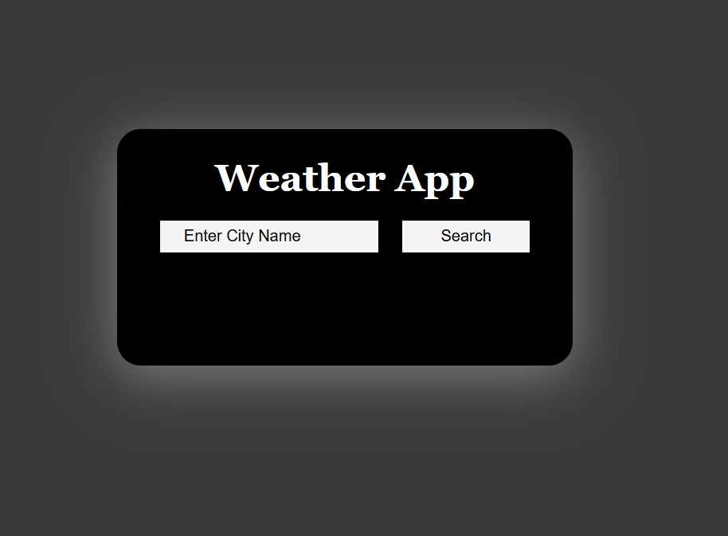
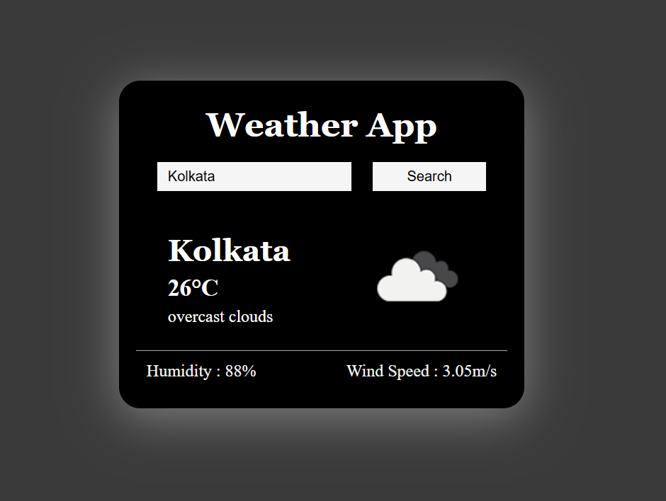

# 🌦️ Weather Web App

A simple and responsive **Weather Application** built using **HTML, CSS, and JavaScript**.  
It fetches real-time weather data and displays key details including:

- 🌡️ Temperature  
- 🏙️ City Name  
- ☁️ Weather Description  
- 💨 Wind Speed  
- 💧 Humidity  
- 🌍 Weather Icon  

---

### ✨ Features

- 🔎 Search weather by city name  
- 🌡️ Real-time temperature updates  
- ☁️ Weather conditions with dynamic icons  
- 💨 Wind speed and 💧 humidity display  
- 📱 Fully responsive design for all screen sizes  

---

### 🛠️ Tech Stack

- **HTML5** – structure  
- **CSS3** – styling and responsive layout  
- **JavaScript (Vanilla)** – API calls and interactivity  
- **Weather API** – for real-time weather data  

---

### 📸 Demo

> 🌐 [Live Demo](https://vidushi-coder.github.io/Weather-WebApp/Weather-App.html)  

---

### 📂 Project Structure

Weather-App/  
├── Weather-App.html  
├── Weather-App.css  
├── Weather-App.js  

---

### 🚀 How to Use

1. Open the app.  
2. Enter the name of any city in the search bar.  
3. Get instant weather details including temperature, description, wind, and humidity.  

---

### 📸 Project Preview

  
  

---

### 📌 Note

This project is for **learning and practice purposes** only. It uses free weather API data and is not meant for production use.
